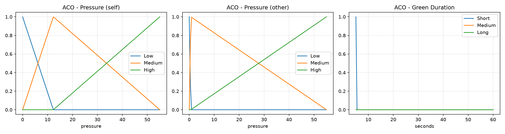
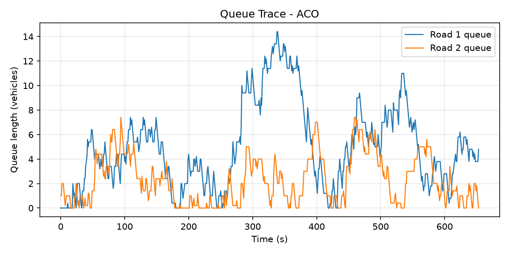
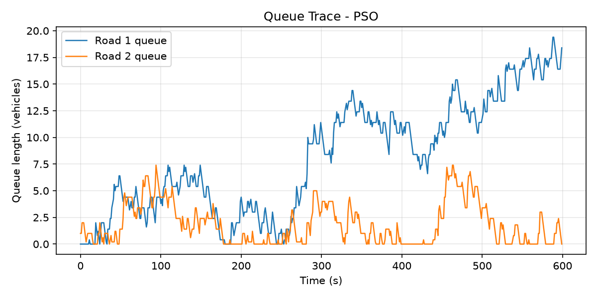

# Fuzzy Traffic Light Controller Optimization using PSO & ACO

This project implements a Mamdani Fuzzy Logic Controller (FLC) to optimize traffic light timings at a two-road intersection. To achieve optimal performance under varying traffic demands, the fuzzy membership functions and rule base parameters are optimized using two metaheuristic algorithms: **Particle Swarm Optimization (PSO)** and **Ant Colony Optimization (ACO)**.

---

## 📌 Project Overview
Urban traffic congestion is a dynamic, non-linear control problem. Standard fixed-time traffic controllers fail to adapt to real-time traffic fluctuations. This project models a discrete-time traffic simulation for a two-road intersection and evaluates three approaches:
1. **Baseline Mamdani Fuzzy Controller**: Uses pre-defined heuristic membership functions.
2. **PSO-Optimized Fuzzy Controller**: Tunes membership function parameters to minimize a joint traffic cost function.
3. **ACO-Optimized Fuzzy Controller**: Searches the optimal parameter configuration space to minimize the same cost function.

### Cost Function
The performance of each controller is evaluated using the following multi-objective cost function:
$$\text{Cost} = \alpha W + \beta Q + \gamma S$$
Where:
- $W$: Average waiting time of vehicles.
- $Q$: Average queue length at the intersection.
- $S$: Total number of stops.
- $\alpha, \beta, \gamma$: Weight factors adjusting the priority of each metric.

---

## 📂 Repository Structure
```
fuzzy-traffic-light-optimization/
│
├── README.md
├── requirements.txt
├── .gitignore
│
├── src/
│   ├── __init__.py
│   ├── simulation.py                # Intersection environment class
│   ├── fuzzy_controller.py          # Fuzzy inference system setup
│   ├── cost.py                      # Cost function calculator
│   ├── pso.py                       # PSO algorithm implementation
│   ├── aco.py                       # ACO algorithm implementation
│   └── plots.py                     # Visualization helpers
└──
|__ sim /
|   |__ data/
|   |__ app.py
|   |__ loader.py
|   |__ render.py
|   |__ simulation.py
```

## 🛠️ Installation & Setup
Clone the Repository:
bash
   git clone https://github.com/AminShiravani/fuzzy-traffic-light-optimization.git
   cd fuzzy-traffic-light-optimization
   
Create and Activate Virtual Environment:
```bash
   python3 -m venv .venv
   source .venv/bin/activate
   ```
Install Dependencies:
```bash
   pip install -r requirements.txt
   ```
## 🚀 Workflow & Execution
We follow a Notebook-first iterative development approach. You can run individual modules through Jupyter Notebooks or execute the clean scripts inside the src/ directory.

1. Run the Jupyter Notebooks
Start the Jupyter environment to explore the steps step-by-step:

bash
jupyter notebook
Open and run the notebooks inside the notebooks/ directory sequentially.

2. Running Simulations (Python Scripts)
Once the parameters are optimized, you can run the main simulation scripts:

```bash
python src/simulation.py
```

## 🚦 Traffic Simulation (Pygame)

In addition to the optimization algorithms, the project includes a real-time traffic visualization built with **Pygame**.

The simulation is located in the `sim/` directory and provides a graphical representation of the intersection, allowing users to observe how the optimized fuzzy controllers manage traffic flow.

### How it Works

1. The optimization algorithms (PSO or ACO) generate simulation data.
2. The generated traffic data is stored as **JSON** files inside the `sim/data/` directory.
3. The Pygame application reads these JSON files.
4. Vehicles are animated according to the recorded traffic states, making it possible to visually inspect queue evolution, signal changes, and vehicle movement.

```
sim/
│
├── data/               # JSON files containing simulation states
├── app.py              # Starts the Pygame application
├── loader.py           # Loads JSON simulation data
├── render.py           # Draws vehicles, roads, and traffic lights
└── simulation.py       # Controls the simulation playback
```

Run the visualization using:

```bash
python sim/app.py
```

This visualization is intended for demonstration purposes and provides an intuitive way to compare different traffic control strategies.


## 📈 Membership Functions

The following figure shows the fuzzy membership functions learned by the **Ant Colony Optimization (ACO)** algorithm.



The membership functions divide each linguistic variable into three fuzzy sets:

- **Low**
- **Medium**
- **High**

These fuzzy sets are used by the Mamdani fuzzy inference system to determine the appropriate green-light duration based on the current traffic conditions. During optimization, ACO adjusts the shape and position of these membership functions to improve overall traffic performance.

## 🚗 Queue Length Comparison (ACO)

The figure below illustrates the traffic queue lengths during the simulation for the controller optimized using **ACO**.



The plot shows:

- **Queue 1:** Number of vehicles waiting on Road 1.
- **Queue 2:** Number of vehicles waiting on Road 2.

The ACO-optimized controller maintains a balanced distribution of traffic between both roads, preventing one direction from becoming excessively congested while still allowing efficient traffic flow.

## 🚗 Queue Length Comparison (PSO)

The following figure shows the queue evolution for the **PSO-optimized** controller.



Unlike ACO, the PSO solution tends to prioritize one traffic direction. As a result, one queue remains relatively short while the other grows significantly larger.

This behavior demonstrates that although PSO is capable of reducing the overall optimization cost, it may produce less balanced traffic flow compared with the ACO-based controller.


## 📊 Evaluation Metrics & Results
The final comparison analyzes:

Convergence Curves: Rate of cost reduction over generations/iterations for both PSO and ACO.
Queue Profiles: Traffic queue lengths on both roads over simulation steps.
Statistical Summary: Comparison table showing Average Wait Time, Max Queue Length, Stop Count, and Final Cost across all methods.
All plots and performance data are exported automatically to the results/ folder.

## 👥 Contributors
Amin Shiravani - Student in Software Analysis and Design / Computational Intelligence
Abolfazl Shahsavari - Student in Software Analysis and Design / Computational Intelligence
